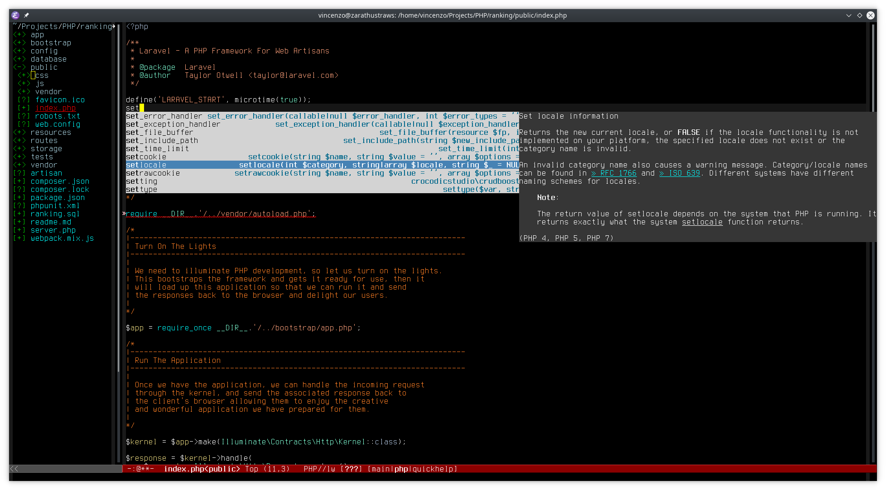

# php-quickhelp [](https://melpa.org/#/php-quickhelp)

Provide quick help (and a eldoc beckend) for company-php and company-phpactor.
It require [jq](https://stedolan.github.io/jq/ "Jq cmd-line json processor") to extract a short help from php manual.



## Installation

You can install `php-quickhelp` from [MELPA](http://melpa.org/#/php-quickhelp) with `package.el`

```
 M-x package-install php-quickhelp
```

## Usage

After having installed this package, run `php-quickhelp-download-or-update` which downloads, from php.net, the php_manual_en.json file into `~/.emacs.d/php-quickhelp-manual` directory.

php-quickhelp wraps company-php and company-phpactor.

For company-phpactor you can do something like this:

``` elisp
(add-hook 'php-mode-hook (lambda ()
    ;; .... other configs
    (require 'php-quickhelp)
    (set (make-local-variable 'company-backends)
    '(php-quickhelp-company-phpactor company-web-html company-dabbrev-code company-files))
(company-mode)))

```

For company-php, something like this:

``` elisp
(add-hook 'php-mode-hook (lambda ()
    ;; .... other configs
    (require 'php-quickhelp)
    (set (make-local-variable 'company-backends)
    '(php-quickhelp-company-php company-web-html company-dabbrev-code company-files))
(company-mode)))

```

If you want to use the eldoc backend you can put, in your php-mode-hook, this:

``` elisp
(setq eldoc-documentation-function
       'php-quickhelp-eldoc-func)
```

The function `php-quickhelp-at-point` can be used to show the documentation in the echo area.

## TODO

- ac-php support
